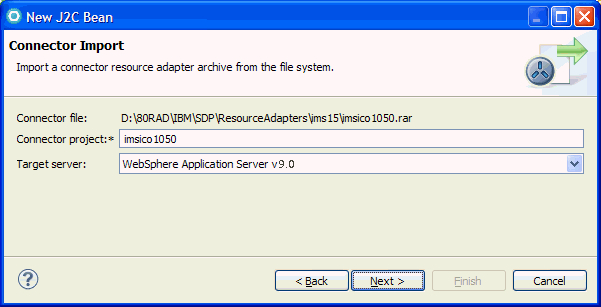
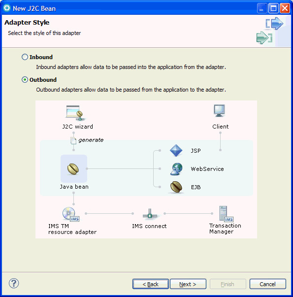
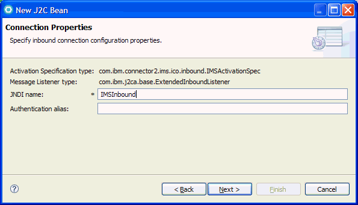
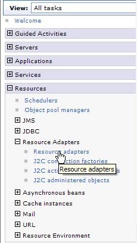
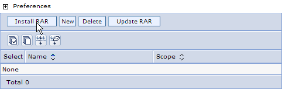
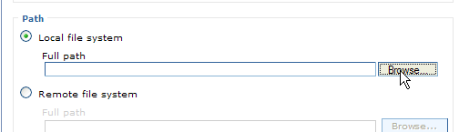
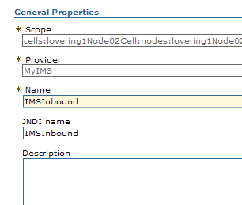
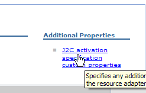

# Create a J2C application for an IMS inbound transaction

The following example demonstrates how to use the J2C wizard to build a message-driven bean that processes an IMS™ inbound transaction.

This tutorial is divided into several exercises that must be completed in sequence for the tutorial to work properly. This tutorial teaches you how to use the J2C Java™ Bean wizard to create a Java bean that runs a transaction in IMS. While completing the exercises, you will:

* Use the J2C Java bean wizard to submit a transaction to IMS.
* Deploy and run the MDB in the WebSphere® Application Server
* Set up and run the IMS callout sample application to issue a synchronous callout message.

To use this sample, you must have an application server installed and configured. To verify that a server runtime environment is available, click **Window > Preferences**, expand Server, and then click **Installed Runtimes**. You can use this pane to add, remove, or edit installed server runtime definitions. You can also download and install support for a new server.

## Overview

When an IMS application issues a request to an external Java application or web service and expects a response to return in the same transaction, the request is referred to as a synchronous callout request from the perspective of an IMS application, and as an inbound transaction from the perspective of WebSphere Application Server.

When an IMS application issues a synchronous callout request, it must specify an IMS OTMA destination descriptor that handles the routing of the message. This destination contains the name of the transaction pipe (TPIPE) that is used to hold the callout message. The IMS TM resource adapter that is deployed on WebSphere Application Server pulls the callout requests from the hold queue.
Steps to implement a synchronous callout solution for an IMS application:

1. Create or modify an IMS application to issue a callout request by using the DL/I ICAL call (on the IMS host system)
 2. Define an OTMA destination descriptor (on the IMS host system)
 3. Create a J2C application for an IMS inbound transaction
 4. Run the IMS application to issue the synchronous callout request (on the IMS host system)
#### Note
This tutorial demonstrates step 3 in the overall implementation.

For end-to-end testing and verification, if you choose to import the IMS inbound sample, this tutorial also provides instructions to modify the inbound sample so you can use the IMS callout sample application that is provided with the IMS synchronous callout function through the IMS installation verification program (IVP). This IMS callout sample IVP includes:
* A sample IMS application that, when run, issues a synchronous callout request. This application specifies to use a pre-defined OTMA destination descriptor (IVPDTOR4) and transaction pipe (IVPPIPE4) for routing and queuing the callout message. All this sample IMS application does is to issue a callout request with a "HELLO FROM IMS" message and waits for a response.
* IVP jobs and tasks that you can run to set up the required OTMA destination descriptor for routing the callout message and the transaction pipe (a queue) for holding the callout message. 

## Program flow and architecture

The following diagram describes the IMS synchronous callout message flow, by using the OTMA destination descriptor name and TPIPE value (queue name) that are supplied in the IMS callout sample IVP.


## System Requirements

To complete this tutorial, you need to have the following tools and components installed: 

* IBM® WebSphere® Application Server, version V7.0, V8.0, V8.5, or V9.0.
* J2EE Connector (J2C) tools installed.
* Information about your IMS environment: In this tutorial, your application interacts with an IMS application program in IMS. You need to obtain information such as the host name and port number of IMS Connect and the name of the IMS data store where the transaction runs. Contact your IMS systems administrator for this information. Specifically, you need to perform some setup work in IMS if you want to run the IMS\PhoneBook IMS program. 
* A copy of the COBOL file [SYCALOUT.cpy](https://github.com/imsdev/ims-java-jee-tm/blob/master/inbound/sycalout.cpy).
* A clean workspace.

## Select a resource adapter

1.	If the Java™ EE icon,  , does not appear in the top right tab of the workspace, you need to switch to the Java EE perspective. From the menu bar, select **Window > Open Perspective > Other**. The Select Perspective page opens.
2.	Select **Java EE**.
3. Click **OK**. The Java EE perspective opens.
4.	In the Java EE perspective, select **File > New > Other**. 
5.	In the New page, select **J2C > J2C Bean**. Click **Next**.
6.	In the Resource Adapters Selection page, select **IMS TM**. For this tutorial select **IMS TM Resource Adapter (IBM:10.5.0)**. Click **Next**. 
7.	On The Connector Import page, select **WebSphere® Application Server v. 9.0.** 



8.	On the Adapter Style page, select **Inbound**.



9.	In the Connection Properties page:
    1. In the **Activation Specification type** field, accept the default.
	1. **Required*** In the **JNDI name** (Required) field, type a JNDI name for your connection.
	1. In the **Authentication alias** field, type an Authentication alias.

    1. Click **Next**.
10. You can obtain the connection information from your IMS system administrator. When you have provided the required connection information, click **Next**.

## Setting up the EJB project with Message-driven bean

1.	All work done in the workbench must be associated with a project. Projects provide an organized view of the work files and directories, optimized with functions based on the type of project. In the workbench, all files must reside in a project, so before you create the create a message-driven bean you need to create a project to put it in. In the New J2C bean page, type the value IMSInbound in the **EJB Project Name** field. 
2.	Click **New** beside the **Project Name** field to create the new EJB project.
3. In the New EJB Project page, provide following values:
    1. **Project name**: IMSInbound
    1.  **Project contents**: accept default
    1. **Target Runtime**: WebSphere® Application Server v9.0
    1. **EJB Module version**: 3.0
    1. **Add project to an EAR**: checked
    1. **EAR Project name**: IMSInboundEAR
4. Click **Finish**.
5. On the J2C Java™ bean output properties page, provide following values:
    1. **Project name**: IMSInbound
	1. **Package name**: sample.ims
    1. **Stateless Session EJB's local business interface name**: CALLOUT
    1. **Stateless Session EJB name**: CALLOUTSB
    1. **Message Driven EJB name**: CALLOUTMDB
6. Click **Next**, and the Java Methods page opens.

## Creating the Java method

1.	On the Java Method page, click **Add**.
2.	In the **Queue name** field, type IVPPIPE4. The queue name is the name of the transaction pipe where the IMS™ callout messages are held. IVPPIPE4 is the pre-defined transaction pipe that is used by the IMS callout sample. For more information about the queue name, see [this tutorial on the Knowledge Center](https://www.ibm.com/support/knowledgecenter/SSRTLW_9.6.1/com.ibm.j2c.doc/tutorials/imsin13.html).
3.	In the **EJB method name** field, type 'invokeCall'.
4.	Beside the **Input type** field of the Java Method page, click **New**.
5.	In the Data Import page, ensure that the **Choose mapping** field is **COBOL to Java**. Click **Browse** beside the **COBOL file** field.
6. Browse to find the file location of the [SYCALOUT.cpy](https://github.com/imsdev/ims-java-jee-tm/blob/master/inbound/sycalout.cpy) file.
  
7.	Click **Open**.
8. Click **Next**.
9.	In the COBOL Importer page, click **Show Advanced**. 
    1. Select the following options:
    
    | Parameter           		| Value           |
    | -------------       				|:-------------:  |
    | Platform Name       	| Z/OS            |
    | Codepage            		| IBM-037      |
    | Floating point format name | IBM® Hexadecimal |
    | External deimal sign| EBCDIC       |
    | Endian name         		| Big             |
    | Remote integer endian name| Big     |
    | Quote name          		| DOUBLE          |
    | Trunc name          		| STD            |
    | Nsymbol name        	| DBCS         |
    
    2. Click **Query** to load the data.
    3. A list of data structures from the Ex01.cbl file is shown.  Select **CALLOUT-REQUEST** in the **Data structures** field. 
    4. Click **Next**.
10.  In the Saving properties page:
    1. Select **Default** for Generation Style.
    1. Click **Browse** beside the **Project Name** and choose the web project IMSPhoneBook.
    1. In the **Package Name** field, type sample.ims.data. 
    1. In the **Class Name** field, accept the default **CALLOUTREQUEST**. Click **Finish**.
11.	Beside the **Output type** field of the Java Method page, click **New**. 
12.	In the Data Import page, ensure that the **Choose mapping** field is COBOL to Java. Click **Browse** beside the **COBOL file** field.
13.	Browse to find the file location of the [SYCALOUT.cpy](https://github.com/imsdev/ims-java-jee-tm/blob/master/inbound/sycalout.cpy) file.
14. Click **Open**.
15.	Click **Next**.
16.	In the COBOL Importer page, click **Show Advanced**.
    1. Select the following options:
    
    | Parameter           | Value           |
    | -------------       |:-------------:  |
    | Platform Name       | Z/OS            |
    | Codepage            | IBM-037         |
    | Floating point format name | IBM® Hexadecimal |
    | External deimal sign| EBCDIC          |
    | Endian name         | Big             |
    | Remote integer endian name| Big       |
    | Quote name          | DOUBLE          |
    | Trunc name          | STD             |
    | Nsymbol name        | DBCS            |
    2. Click **Query** to load the data.
    3. A list of data structures is shown. Select **CALLOUT-RESPONSE** in the **Data structures** field. 
    4. Click **Next**.

17. In the Saving properties page:
    1. Select **Default** for **Generation Style**.
    2. Click **Browse** beside the **Project Name** and choose the web project IMSInbound.
    3. In the **Package Name** field, type sample.ims.data. 
    4. In the **Class Name field**, accept the default CALLOUTRESPONSE. Click **Finish**.
    
18.	Click **Finish**.
19.	Click **Finish** to complete the definition of the method.
20.	After all artifacts are generated, select **IMSInbound > ejbModule > sample.ims**, right click CALLOUTSB.java, and select  **Open With > Java Editor**. Edit the invokeCall method: 
```
  public sample.ims.data.CALLOUTRESPONSE invokeCall(
              		 		 		 sample.ims.data.CALLOUTREQUEST cALLOUTREQUEST) {
              		 		 // TODO Need to implement business logic here. 
              		 		 System.out.println("Synchronous callout request from IMS to WebSphere MDB");		 		 
              		 		 
              		 		    
                      System.out.println(cALLOUTREQUEST.getCallout__request__str());
              
                      sample.ims.data.CALLOUTRESPONSE response = new CALLOUTRESPONSE();
                      System.out.println("Synchronous callout response from WebSphere MDB to IMS");		 		 
                      response.setCallout__response__str("HELLO FROM WAS MDB");
                      return response;
  }
```

## Configure WebSphere Application Server and add project to the server
1. Click **Servers view**.

#### Note
If you do not see the Servers view, you must open the Servers view, select **Window > Show View > Servers**.

2. In the Servers view, right click WebSphere Application Server v9.0 and select **Start**.
3. Once the server is started, right click WebSphere Application Server v9.0 and select **Administration > Run administrative console**. The administrative console appears in the Editor area of your workspace.
4. Select **Resources > Resource Adapters > Resource Adapters**.



5. On the Resource Adapters page, click **Install RAR**.



6. On the Resource Adapters page, in the path field, click **Browse** to locate the RAR file. This file is located in your install directory, under <install_dir>/IBM/SDP/ResourceAdapters/ims15. Select imsico1030.rar, and click **Open**.



7. On the Install RAR page, click **Next**.
8. n the Resource Adapters page, provide a name for this resource adapter (IMS TM Resource Adapter) and click **OK**.
9. On the Resource Adapters page, click **Save**.
10. On the Resource Adapters page, click your new resource adapter (IMS TM Resource Adapter). On the IMS TM Resource Adapter page, in the **Additional Properties** field, click **J2C activation specifications**.
11. On the J2C activation specifications page, click **New**.
    1. In the Name field, type a name for the activation specifications, for example, **Test**.
	1. In the JNDI name field, type a JNDI name, for example, IMSInbound:
	
	1. Click **Apply**.
12. On the Resource Adapters page, click **Save**.
13. On the J2C activation specifications page, click your activation specification resource (**IMSInbound**).
14. On the J2C activation specifications page, in the **Additional properties** field, click **J2C activation specification custom properties**. 

    Set the custom properties (You can obtain these values from your IMS administrator):
    1. Click **dataStoreName**, and provide a value for the IMS datastore name. Click **Apply**, and on the Resource Adapters page, click **Save**.
    1. Click **hostName**, and provide a value for the host name. Click **Apply**, and on the Resource Adapters page, click **Save**.
    1. Click **portNumber**, and provide a value for the port number. Click **Apply**, and on the Resource Adapters page, click **Save**.
    1. Click **queueNames**, and type IVPPIPE4 for the Queue name, click **Apply**, and on the Resource Adapters page, click **Save**.
15. In the Servers view, right click WebSphere Application Server v9.0 and select **Add and remove projects**. Select **IMSInboundEar**, and click **Add**. Click **Finish**. Your application is now published to the server. 

## Results
To run the sample IMS callout application, run the IV_S228J job as described in the IV_S001T task. This completes the inbound transaction tutorial.

## What to do next
Once the event is triggered from the IMS server, the following output displays on the console: 
```
[2/17/09 13:52:11:787 EST] 00000015 SystemOut     O Synchronous callout request from IMS to WebSphere MDB
[2/17/09 13:52:11:787 EST] 00000015 SystemOut     O HELLO FROM IMS                                    
[2/17/09 13:52:11:787 EST] 00000015 SystemOut     O Synchronous callout response from WebSphere MDB to IMS
```
