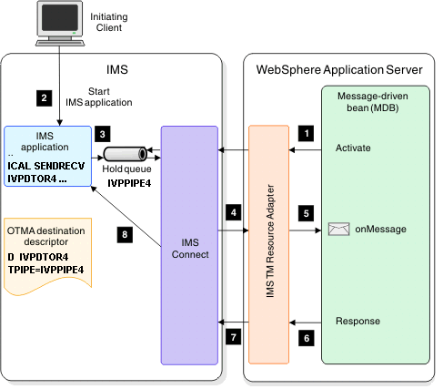

# Create a J2C application for an IMS inbound transaction

The following example demonstrates how to use the J2C wizard to build a message-driven bean that processes an IMS™ inbound transaction.

This tutorial is divided into several exercises that must be completed in sequence for the tutorial to work properly. This tutorial teaches you how to use the J2C Java™ Bean wizard to create a Java bean that runs a transaction in IMS. While completing the exercises, you will:

* Use the J2C Java bean wizard to submit a transaction to IMS.
* Deploy and run the MDB in the WebSphere® Application Server
* Set up and run the IMS callout sample application to issue a synchronous callout message.

To use this sample, you must have an application server installed and configured. To verify that a server runtime environment is available, click **Window > Preferences**, expand Server, and then click **Installed Runtimes**. You can use this pane to add, remove, or edit installed server runtime definitions. You can also download and install support for a new server.

## Overview

When an IMS application issues a request to an external Java application or web service and expects a response to return in the same transaction, the request is referred to as a synchronous callout request from the perspective of an IMS application, and as an inbound transaction from the perspective of WebSphere Application Server.

When an IMS application issues a synchronous callout request, it must specify an IMS OTMA destination descriptor that handles the routing of the message. This destination contains the name of the transaction pipe (TPIPE) that is used to hold the callout message. The IMS TM resource adapter that is deployed on WebSphere Application Server pulls the callout requests from the hold queue.
Steps to implement a synchronous callout solution for an IMS application:

1. Create or modify an IMS application to issue a callout request by using the DL/I ICAL call (on the IMS host system)
 2. Define an OTMA destination descriptor (on the IMS host system)
 3. Create a J2C application for an IMS inbound transaction
 4. Run the IMS application to issue the synchronous callout request (on the IMS host system)
#### Note
This tutorial demonstrates step 3 in the overall implementation.

For end-to-end testing and verification, if you choose to import the IMS inbound sample, this tutorial also provides instructions to modify the inbound sample so you can use the IMS callout sample application that is provided with the IMS synchronous callout function through the IMS installation verification program (IVP). This IMS callout sample IVP includes:
* A sample IMS application that, when run, issues a synchronous callout request. This application specifies to use a pre-defined OTMA destination descriptor (IVPDTOR4) and transaction pipe (IVPPIPE4) for routing and queuing the callout message. All this sample IMS application does is to issue a callout request with a "HELLO FROM IMS" message and waits for a response.
* IVP jobs and tasks that you can run to set up the required OTMA destination descriptor for routing the callout message and the transaction pipe (a queue) for holding the callout message. 

The following diagram describes the IMS synchronous callout message flow, by using the OTMA destination descriptor name and TPIPE value (queue name) that are supplied in the IMS callout sample IVP.

## System Requirements

To complete this tutorial, you need to have the following tools and components installed: 

* IBM® WebSphere® Application Server, version V7.0, V8.0, V8.5, or V9.0.
* J2EE Connector (J2C) tools installed.
* Information about your IMS environment: In this tutorial, your application interacts with an IMS application program in IMS. You need to obtain information such as the host name and port number of IMS Connect and the name of the IMS data store where the transaction runs. Contact your IMS systems administrator for this information. Specifically, you need to perform some setup work in IMS if you want to run the IMS\PhoneBook IMS program. 
* A copy of the COBOL file [SYCALOUT.cpy](https://github.com/imsdev/ims-java-jee-tm/blob/master/inbound/sycalout.cpy).
* A clean workspace.
