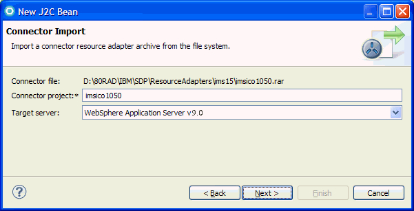
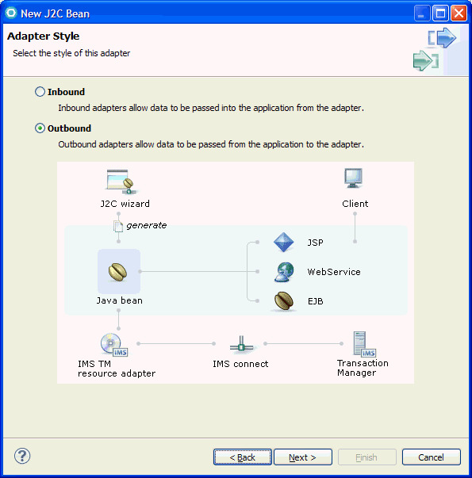
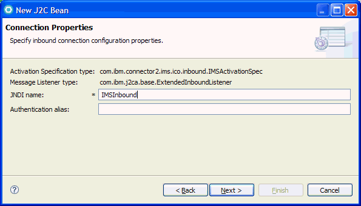
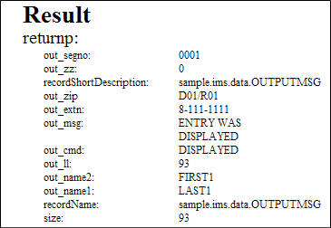
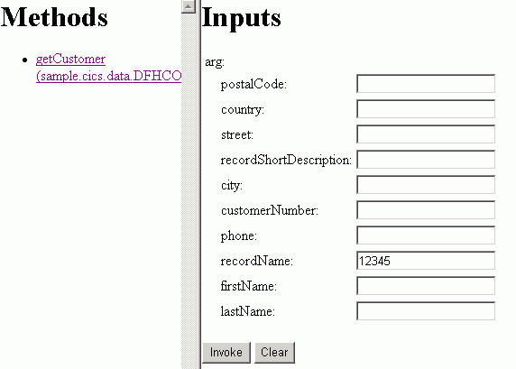
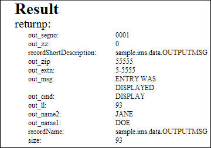

# Create a J2C application for an IMS phone book transaction

The following example demonstrates how to use the J2C wizard to build a simple web application that processes an IMS™ transaction that returns a phone book record.

This tutorial is divided into several exercises that must be completed in sequence for the tutorial to work properly. This tutorial teaches you how to use the J2C Java™ Bean wizard to create a Java bean that runs a transaction in IMS. While completing the exercises, you will:

* Use the J2C Java bean wizard to submit a transaction to IMS.
* Create a Java method, runPhonebook.java, which accepts a customer number and returns information about the customer.

To use this sample, you must have an application server installed and configured. To verify that a server runtime environment is available, click **Window > Preferences**, expand Server, and then click **Installed Runtimes**. You can use this pane to add, remove, or edit installed server runtime definitions. You can also download and install support for a new server.

## System Requirements

To complete this tutorial, you need to have the following tools and components installed: 

* IBM® WebSphere® Application Server, version V7.0, V8.0, V8.5, or V9.0.
* J2EE Connector (J2C) tools installed.
* Information about your IMS environment: In this tutorial, your application interacts with an IMS application program in IMS. You need to obtain information such as the host name and port number of IMS Connect and the name of the IMS data store where the transaction runs. Contact your IMS systems administrator for this information. Specifically, you need to perform some setup work in IMS if you want to run the IMS\PhoneBook IMS program. 
* A copy of the COBOL file [EX01.cbl](https://github.com/imsdev/ims-java-jee-tm/blob/master/phonebook/EX01.cbl).
* A clean workspace.

## Select a resource adapter

1.	If the Java™ EE icon,  , does not appear in the top right tab of the workspace, you need to switch to the Java EE perspective. From the menu bar, select **Window > Open Perspective > Other**. The Select Perspective page opens.
2.	Select **Java EE**, and click **OK**. The Java EE perspective opens.
3.	In the Java EE perspective, select **File > New > Other**. 
4.	In the New page, select **J2C > J2C Bean**. Click **Next**.
5.	In the Resource Adapters Selection page, select **IMS TM**. For this tutorial select **IMS TM Resource Adapter (IBM:10.2.0)**. Click **Next**. 
6.	On The Connector Import page, select **WebSphere® Application Server v. 9.0.** 



7.	On the Adapter Style page, select **Outbound**.



8.	On the Scenario Selection page, select **IMS COBOL, PL/I, or C-based applications**. 



9.	In the Connection Properties page, select **Managed connection**. 
10.	If you already have a JNDI connection created, click **Browse** to locate your JNDI. If you do not have a JNDI connection, click **New**.
11.	On the Server Selection page, select **WebSphere Application Server v9**.
12.	Click **Next**.
13.	On the New J2C Connection Factory page, accept the default Connection class name of com.ibm.connector2.ims.ico.IMSManagedConnectionFactory. In the blank fields, enter all the required connection information. Required fields, indicated by an asterisk (*), include the following: 
    1. **For TCP/IP connection**: 
        1. **Host name**: (Required) The IP address or host name of IMS Connect.
        1. **Port Number**: (Required) The number of the port used by the target IMS connect. 
    1. **For local option connection**:
        1. **IMS Connect name**:(Required) The name of the target IMS connect. 
    1. **For both**:
        1. **Data Store Name**: (Required) The name of the target IMS data store. 
#### Important
You can obtain the connection information from your IMS system administrator.

14.	When you have provided the required connection information, click **Next**.

## Setting up the Web project and Java interface and implementations

1.	All work done in the workbench must be associated with a project. Projects provide an organized view of the work files and directories, optimized with functions based on the type of project. In the workbench, all files must reside in a project, so before you create the J2C bean, you need to create a project to put it in. In the New J2C Bean page, type the value `IMSPhoneBook` in the Project Name field. 
2.	Click the **New** button beside the Project Name field to create the new project
3.	In the New Source Project Creation page, select **Web project**, and click **Next**.
4.	In the New Dynamic Web Project page, ensure that the following values are selected, and click **Finish**: 
    1. **Project name**: IMSPhoneBook
    1. **Contents**: accept default
    1. **Target Runtime**: WebSphere® Application Server v9.0
    1. Dynamic Web Module Version: 2.5
    1. Configuration: accept default
    1. **Add project to an EAR**: checked
    1. **EAR Project name**: IMSPhoneBookEAR
5.	A dialog box appears asking if you would like to switch to the Dynamic Web perspective. Click Yes.
6.	On the J2C Java Bean Output Properties page: 
    1. In the Package name field, **click Browse** and select the IMSPhoneBook project. Click OK.
    1. Type sample.ims in the Package name field.
    1. Type PhoneBook in the Interface name field.
    1. Type PhoneBookImpl in the Implementation name field.
    1. Clear Save session as ant script.
7.	Click **Finish**.

## Creating the Java method

1.	In the Snippets view, select **J2C**. Double click **Add method** to J2C Java bean. 
2.	In the Java Methods page, click **Add**.
3.	In the Name field, type `runPhoneBook`.
4.	In this step, you import the Ex01.cbl (COBOL) file that is needed to create your application. The Ex01.cbl file is located in <installdir>\IBM/IBMIMShared/plugins/com.ibm.j2c.cheatsheet.content\Samples/MS/phonebook, where <installdir> is the directory where this product is installed. The COBOL file contains the application program that runs on the IMS™ server. It has the definition of the structure to be passed to the IMS server via the communications area. This structure represents the customer records being returned from the IMS application program. Before you can work with a file, you must import it from the file system into the workbench. Beside the Input type field, click **New**. 
5.	In the Data Import page, ensure that the Choose mapping field is COBOL_TO_JAVA. Click **Browse** beside the COBOL file.
6.	Locate the Ex01.cbl file in the file system, and click **Open**. 
  
```
IDENTIFICATION DIVISION.                                          
  ENVIRONMENT DIVISION.                                             
  CONFIGURATION SECTION.                                            
  DATA DIVISION. 
  *
  *    IMS Connector for Java, COBOL Transaction Message Source
  *
  *********************************************************************/ 
  *                                                                   */ 
  * (c) Copyright IBM Corp. 2003                                      */ 
  * All Rights Reserved                                               */ 
  * Licensed Materials - Property of IBM                              */ 
  *                                                                   */ 
  * DISCLAIMER OF WARRANTIES.                                         */ 
  *                                                                   */ 
  * The following (enclosed) code is provided to you solely for the   */ 
  * purpose of assisting you in the development of your applications. */ 
  * The code is provided "AS IS." IBM MAKES NO WARRANTIES, EXPRESS OR */ 
  * IMPLIED, INCLUDING BUT NOT LIMITED TO THE IMPLIED WARRANTIES OF   */ 
  * MERCHANTABILITY AND FITNESS FOR A PARTICULAR PURPOSE, REGARDING   */ 
  * THE FUNCTION OR PERFORMANCE OF THIS CODE.                         */ 
  * IBM shall not be liable for any damages arising out of your use   */ 
  * of the generated code, even if they have been advised of the      */ 
  * possibility of such damages.                                      */ 
  *                                                                   */ 
  * DISTRIBUTION.                                                     */ 
  *                                                                   */ 
  * This generated code can be freely distributed, copied, altered,   */ 
  * and incorporated into other software, provided that:              */ 
  *   - It bears the above Copyright notice and DISCLAIMER intact     */ 
  *   - The software is not for resale                                */ 
  *                                                                   */            
  *********************************************************************/
  *
   LINKAGE SECTION.
	                                                   
   01  INPUT-MSG.                                                     
      02  IN-LL          PICTURE S9(3) COMP.                         
      02  IN-ZZ          PICTURE S9(3) COMP.                         
      02  IN-TRCD        PICTURE X(10).                               
      02  IN-CMD         PICTURE X(8).
      02  IN-NAME1       PICTURE X(10).
      02  IN-NAME2       PICTURE X(10).
      02  IN-EXTN        PICTURE X(10).
      02  IN-ZIP         PICTURE X(7).	
						  
   01  OUTPUT-MSG.                                                   
      02  OUT-LL       PICTURE S9(3) COMP VALUE +0.                 
      02  OUT-ZZ       PICTURE S9(3) COMP VALUE +0.                  
      02  OUT-MSG      PICTURE X(40) VALUE SPACES.
      02  OUT-CMD      PICTURE X(8) VALUE SPACES.
      02  OUT-NAME1    PICTURE X(10) VALUE SPACES.
      02  OUT-NAME2    PICTURE X(10) VALUE SPACES.
      02  OUT-EXTN     PICTURE X(10) VALUE SPACES.
      02  OUT-ZIP      PICTURE X(7) VALUE SPACES.
      02  OUT-SEGNO    PICTURE X(4) VALUE SPACES.    		
                        
   PROCEDURE DIVISION.       

```


7.	Click **Next**.
8.	In the COBOL Importer page, click **Show Advanced**. 
    1. Select the following options:
    
    | Parameter           | Value           |
    | -------------       |:-------------:  |
    | Platform Name       | Z/OS            |
    | Codepage            | IBM-037         |
    | Floating point format name | IBM® Hexadecimal |
    | External deimal sign| EBCDIC          |
    | Endian name         | Big             |
    | Remote integer endian name| Big       |
    | Quote name          | DOUBLE          |
    | Trunc name          | STD             |
    | Nsymbol name        | DBCS            |
    
    2. Click **Query** to load the data.
    3. A list of data structures from the Ex01.cbl file is shown. Select INPUT-MSG in the Data structures field.
    4. Click **Next**.
9.  In the Saving properties page, select the following values for input type:
    1. Select Default for Generation Style.
    1. Click **Browse** beside the Project Name and choose the web project IMSPhoneBook.
    1. In the Package Name field, type sample.ims.data. 
    1. In the Class Name field, accept the default INPUTMSG. Click **Finish**.
10.	In the Java method page, click New next to the Output type field. 
11.	In the Data Import page, ensure that the Choose mapping field is COBOL_TO_JAVA. 
12.	Locate the Ex01.cbl file in the file system, and click **Open**.
13.	Click **Next**.
14.	In the COBOL Importer page, click **Show Advanced**. 
    1. Select the following options:
    
    | Parameter           | Value           |
    | -------------       |:-------------:  |
    | Platform Name       | Z/OS            |
    | Codepage            | IBM-037         |
    | Floating point format name | IBM® Hexadecimal |
    | External deimal sign| EBCDIC          |
    | Endian name         | Big             |
    | Remote integer endian name| Big       |
    | Quote name          | DOUBLE          |
    | Trunc name          | STD             |
    | Nsymbol name        | DBCS            |
    2. Click **Query** to load the data.
    3. A list of data structures from the Ex01.cbl file is shown. Select **OUTPUT-MSG** in the **Data structures** field.
    4. Click **Next**.
9.  In the Saving properties page, select the following values for input type:
    1. Select **Default** for Generation Style.
    1. Click **Browse** beside the Project Name and choose the web project IMSPhoneBook.
    1. In the **Package Name** field, type sample.ims.data. 
    1. In the **Class Name** field, accept the default OUTPUTMSG. Click **Finish**.
    1. Leave the Save sessions as Ant script cleared.
16.	On the Java Method page, click **Finish**.
17.	In the Binding Details page, ensure that the interactionVerb is SYNC_SEND_RECEIVE(1) to indicate that the interaction with IMS involves a send followed by a receive interaction. 
18.	Click **Finish**.

## Deploying the application

1.	To create a JSP, click **File > New > Other > J2C**. 
2.	In the Select a wizard page, select **Web Page, Web Service, or EJB from J2C Java bean**, and click **Next**.
3.	In the J2C Java bean selection page, click **Browse**.
4.	In the Find J2C bean page, type an asterisk (*) in the Select entries field. 
5.	In the Matching types field, select PhoneBookImpl.
6.	Click **OK**.
7.	In the J2C Java bean selection page, click **Next**.
8.	In the Deployment Information page, select Simple JSP.
9.	Click **Next**.
10.	In the JSP Creation page, select Generate simple JSPs with default input fields.
11.	In the JSP folder field, enter a JSP Folder name, such as SampleJSP. 
12.	Click **Finish**.
13.	Next you run your JSP: Right-click TestClient.jsp and select **Run on Server**. 
14.	A browser window with the Test Client launches. Click **runPhoneBook method**. 
15.	Use the following values as Inputs: 
    * Type IVTNO in the In__trcd field.
    *	Type 0 in the In___zz field.
    *	Type LAST1 in the In__name1 field.
    *	Type DISPLAY in the In__cmd field.
    *	Type 59 in the In__ll field.
16.	Click Invoke, and this output appears in the Result field. 



17.	Now submit another command to add a phone book entry. Click **runPhoneBookmethod**.
18.	Use the following values as Inputs: 
    * Type 59 in the In__ll field.
    *	Type 0 in the In___zz field.
    *	Type IVTNO in the In__trcd field.
    *	Type Add in the In__cmd field.
    *	Type Jane in the In__name2 field.
    *	Type Doe in the In__name1 field.
    *	Type 55555 in the In__zip field.
    *	Type 5-5555 in the In__extn field.
19.	Click Invoke, and this output appears in the Result field. 



20.	Now submit another command to display the phone book entry you just added. Click runPhoneBook method. 
21.	Use the following values as Inputs: 
   *	Type 59 in the In__ll field.
   *	Type IVTNO in the In__trd field.
   *	Type 0 in the In___zz field.
   *	Type DISPLAY in the In__cmd field.
   *	Type Doe in the In__name1 field.
   *	Type 93 in the size field.
22.	Click Invoke, and this output appears in the Result field. 



####	Now you creates a Faces JSP to deploy the J2C Java bean:
24.	Expand the IMSPhoneBook project, and find the WebContent folder. 
25.	Right click WebContent folder in your IMSPhoneBook project and select **New > Other > Web > Faces JSP file**. 
26.	Type Test in the Name field.
27.	Accept defaults for all other fields. 
28.	Click **Finish**.
29.	Next you add the Java bean to faces JSP: Once you have created the Faces JSP file, the page should open Test.jsp in the Design page. If the workspace does not open in the Design page of the editor, expand the WEB-INF folder under the WebContent folder. Right click Test.jsp, select **Open With**, and click **Page Designer**. Test.jsp opens in the Design page.
30.	The Palette view appears on the right panel. If it does not appear, in the top menu, click **Window > Show view > Palette**. 
31.	In the Datafolder of the Palette view, click the JavaBean option of the Palette.
32.	Drag the JavaBean to the Test.jsp editor; the Add JavaBean wizard opens
33.	Select **Add new JavaBean**.
34.	In the Name field, type phonebookLookup.
35.	Click the open book icon,  , beside the Class field. The Class Selection window appears.
36.	In the Class Selection page, type `PhoneBookImpl` in the Search field.
37.	Clear the Add input/output controls to display the JavaBean on the Web page check box.
38.	Click **Finish**.
39.	You see PhoneBookImpl in the Page Data view. 
40.	Adding input and output controls to the faces JSP: Right-click phonebookLookup Java Bean in the Page Data view, and click **Add New JavaBean Method**. 
41.	From the list of available methods, click **runPhoneBook**. 
42.	Click **OK**.
43.	Expand phonebookLookup Java Bean in the Page Data view, and select the runPhoneBook() method. 
44.	Drag the runPhoneBook() method onto the editor. The Insert JavaBean wizard appears.
45.	In the Create controls for: field, select **Inputting data**. 
46.	In the Fields to display field, select **None**, to clear the form. 
47.	In the Fields to display field, select these input fields 
    * arg.in__trcd
    *	arg.in__zz
    *	arg.size
    *	arg.in__name1
    *	arg.in__cmd
    *	arg.in__ll
48.	Click **Finish**.
49.	Accept defaults for the other fields.
50.	Click **Next**.
51.	In the Configure Data Controls page, select Create controls for displaying the results.
52.	In the Fields to display field, select **None**, to clear the form. 
53.	In the Fields to display field, select these output fields 
    *	out__zz 
    *	out__zip
    *	out__extn 
    *	out__msg
    *	out__cmd 
    *	out__ll 
    *	out__name2 
    *	out__name1 
    *	size
54.	Click **Finish**.
55.	Save your Faces JSP page, by pressing **Ctrl-S** or by clicking **File > Save** in the toolbar. 
56.	Now you test the Faces web page: Select the Servers tab. Start the test server, if it is not already running. To start the server, right click the WebSphere Application Server v9.0 or 8.x and click **Start**. 
57.	Right click Test.jsp (the faces JSP that you created) in the Project Explorer view, and select **Run > Run on Server**.
58.	Select WebSphere Application Server v9.0 or 8.x and click **Finish**.
59.	The browser opens to Test.jsp. Use the following values as Inputs: 
    *	Type IVTNO in the In__trcd field.
    *	Type 59 in the In__ll field.
    *	Type 0 in the In___zz field.
    *	Type DISPLAY in the In__cmd field.
    *	Type LAST1 in the In__name1 field.
    *	Type 93 in the size field.
#### Note
Ensure that there are no extra spaces in the text box before your entry.

60.	Click **Submit**.
61.	You can see the output displayed in your browser.

## Results
You have completed the PhoneBook tutorial.
